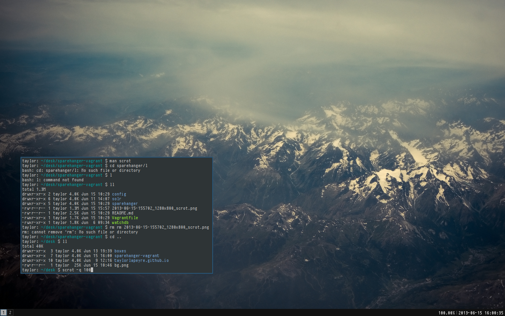
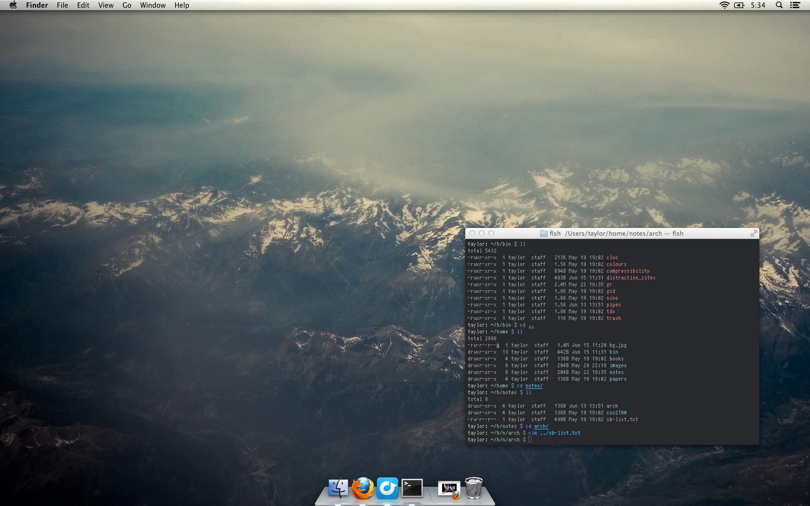

**These are my dotfiles for Unix systems.**

I don't customize my tools heavily, and tend to lean toward sensible defaults whereever possible.

While they are mine, you can use them too. The install script included will backup your existing dotfiles if you want to give them a try.

#### Arch

- window manager - [i3](http://i3wm.org/)
- terminal - [urxvt](http://software.schmorp.de/pkg/rxvt-unicode.html)
- editor - [vim](http://www.vim.org/)
- version control - [git](http://git-scm.com/)
- browser - [firefox](http://www.mozilla.org/en-US/firefox/new/)
- launcher - [dmenu](http://tools.suckless.org/dmenu/)

#### OSX

- terminal - [terminal.app](http://www.apple.com/osx/apps/all.html#terminal)
- editor - [sublime text](http://www.sublimetext.com/)
- version control - [git](http://git-scm.com/)
- browser - [firefox](http://www.mozilla.org/en-US/firefox/new/)
- launcher - [alfred](http://www.alfredapp.com/)

